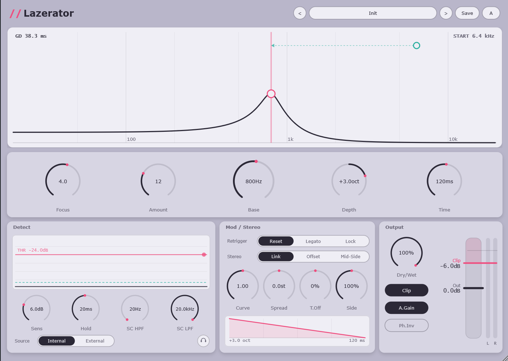

<div align="center">


# Lazerator

**Dynamic Transient Smearing and Auto Sweep Phase Modulator**

A VST3 creative phase effect for Windows. A cascade of all pass filters is driven by a
transient detector, so every hit fires its own exponential frequency sweep. Written in
C++20 on JUCE.


</div>



## What it does

Phase smearing has been part of the bass music vocabulary for a long time, but getting
there usually means drawing automation on a static all pass filter for every single hit,
or wiring an envelope follower to a filter inside a modular host.

Lazerator removes that step. Drop it on a track, set the threshold, and every transient
triggers its own sweep. There is no automation to draw and no routing to build.

Three things shape the design:

1. **Automatic, not manual.** The sweep comes from the signal itself.
2. **Zero reported latency.** Pure IIR, no FFT, so it stays usable while tracking and
   during live performance.
3. **Built for dense patterns.** The retrigger policy, hold time and ratio based detector
   are made to stay accurate on riddim and fast drum patterns, where a generic envelope
   follower normally falls apart.

## Features

### Engine

* Cascade of 1 to 40 all pass stages, sharing one set of coefficients so the
  trigonometry is computed once per sample instead of once per stage.
* Transposed Direct Form II with double precision state, roughly 1.3 kB for the whole
  engine, small enough to stay in L1 cache.
* Group delay readout computed from the exact digital response, with a warning marker
  above 500 ms.

### Detection

* Dual envelope follower with a ratio based decision, so a kick at -30 dBFS and the same
  kick at -6 dBFS read identically.
* Absolute threshold, relative sensitivity and hold time.
* Sidechain high pass and low pass filters, external sidechain input, and a listen switch.
* Compressor style display with a draggable threshold line, plus markers for triggers that
  were accepted and triggers that were rejected by hold.

### Modulation

* Bipolar sweep depth in octaves, so one knob sets both amount and direction.
* Shapeable decay curve, sweep time from 5 ms to 2 s.
* Retrigger modes: Reset, Legato and Lock.
* Sweep shape display where the curve itself is draggable, and where the Offset and
  Mid Side stereo modes draw their two traces separately.

### Stereo

* Link, Offset (spread in semitones plus a sweep time offset) and Mid Side with an
  independent side depth.
* The detector always works on the sum of left and right, so both channels fire together
  and the stereo image widens instead of smearing apart.
* Correlation meter appears automatically in Offset and Mid Side.

### Output

* Clipper with a threshold line on the same dB scale as the level meters. Signal below the
  line passes through untouched, signal above it is cut at the line, and no makeup gain is
  ever added.
* Output gain sits before the clipper, so raising it drives the signal into the ceiling.
* Automatic gain compensation for the peak stacking that fast all pass modulation
  produces, dry wet mix, and polarity invert.

### Interface

* Spectrum analyser with a 3.5 dB per octave tilt, so the top end stays readable.
* Draggable nodes on the response curve. Horizontal sets base frequency, vertical sets the
  stage count, and the scroll wheel sets focus.
* Base frequency snaps to equal tempered notes while dragging. Hold Shift for free
  movement, or double click any knob to type an exact value.
* 60 factory presets, exported to disk as editable files on first run.
* Resizable from 70 percent to 200 percent with the whole layout scaled as one unit.

## Building

The repository does not redistribute JUCE, so fetch it first.

```bash
git clone https://github.com/ClyntiaAikaHanaa/Lazerator.git
cd Lazerator
git clone --branch 8.0.4 --depth 1 https://github.com/juce-framework/JUCE.git
```

Then configure and build. Any recent MSVC toolchain works, the project was developed
against Visual Studio Build Tools 2026.

```bash
cmake -S . -B build -A x64
cmake --build build --config Release --target Lazerator_VST3
```

The VST3 is written to `build/Lazerator_artefacts/Release/VST3/` and copied into the
system VST3 folder. Close your DAW before building, otherwise the copy step fails because
the plugin is still loaded.

Other targets:

| Target | Result |
| --- | --- |
| `Lazerator_VST3` | VST3 plugin |
| `Lazerator_Standalone` | Standalone application, useful for quick checks |
| `LazeratorTests` | Offline DSP measurement harness |

macOS and AU are configured in CMake but have not been built or tested.

## Tests

`LazeratorTests` is a console program that measures the DSP rather than asserting on
opaque values. It reports the clipper transfer curve, total harmonic distortion at several
drive settings, the effect of auto gain and polarity invert, and it returns a non zero exit
code if the clipper ever adds gain or if clipping stops rising as the threshold is lowered.

```bash
cmake --build build --config Release --target LazeratorTests
./build/LazeratorTests_artefacts/Release/LazeratorTests.exe
```

## Project layout

```
Source/
  LazerDSP.*        engine: detector, sweep, all pass cascade, output stage
  PluginProcessor.* parameters, buses, state
  PluginEditor.*    fixed size canvas, scaled by a single transform
  Visualizer.*      spectrum, group delay curve, draggable nodes
  DetectView.*      compressor style detector display
  SweepView.*       modulation shape display
  OutputSlider.*    clip threshold and output gain, with L and R meters
  Presets.*         factory preset seed and folder scanning
  Controls.*        segmented control, typed value knob, note helpers
  LazerLook.*       palette and look and feel
Tests/
  DspTests.cpp      offline measurement harness
Screenshot/
  main.png
```

User presets live in `Documents/Lazerator/Presset`. The folder is the source of truth at
runtime, so adding, editing or deleting files there changes what the preset menu shows.
The built in table only seeds the folder when it is completely empty.

## Licence

Lazerator is released under the **GNU General Public License version 3**. See
[LICENSE](LICENSE) for the full text.

This means you may use, study, modify and redistribute the code, provided that derivative
works are also released under the GPL and that you keep the source available.

## Third party notices

**JUCE.** This project builds against [JUCE](https://juce.com), which is dual licensed
under the GPLv3 and a commercial licence. Releasing Lazerator under the GPLv3 relies on
the GPLv3 option. If you distribute binaries under that option, the JUCE splash screen has
to stay enabled unless you hold a commercial JUCE licence. JUCE itself is not included in
this repository and keeps its own licence.

**VST3.** VST is a registered trademark of Steinberg Media Technologies GmbH. The VST3 SDK
ships inside JUCE and is licensed by Steinberg under either the GPLv3 or a proprietary
agreement. This project uses the GPLv3 option. Steinberg also requires anyone distributing
VST3 binaries to register as a VST3 developer and to accept the VST3 licensing terms.
Neither Steinberg nor Lazerator are affiliated with or endorsed by each other.

Product names, logos and brands mentioned anywhere in this project belong to their
respective owners and are used for identification only.

## Credits

**anak baek**, DSP, program and design.
**WOY**, design and marketing.

Supported by Creation Vault.
